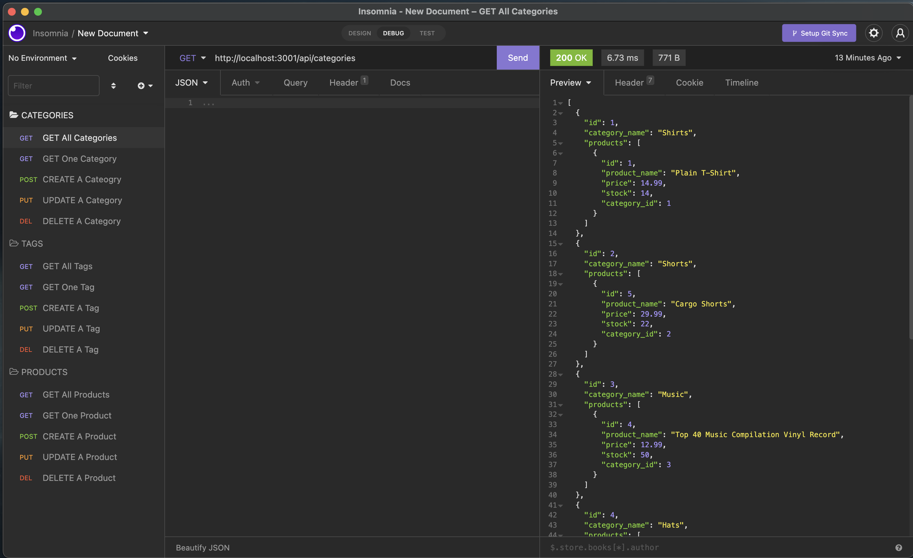
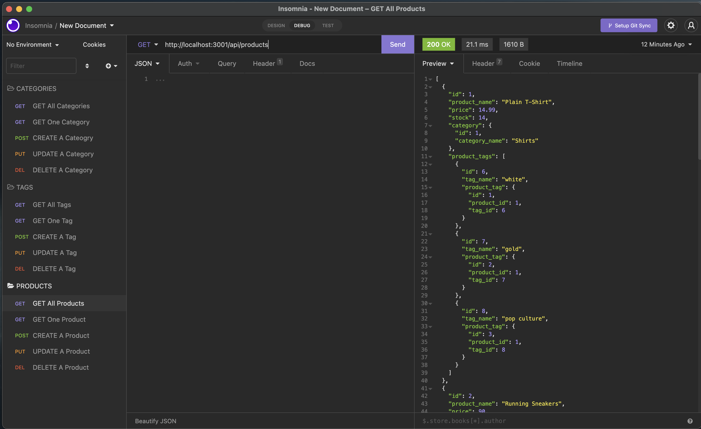
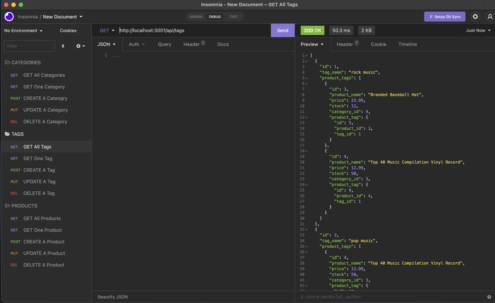

# Object Relational Mapping: E-Commerce-Back-End


## Description
A back end code for an e-commerce site using Express.js and Sequelize to interact with a MySQL database. 

## Table of Contents
- [User Story](#user-story)
- [Installation](#installation)
- [Usage](#usage)
- [Media](#media)
- [License](#license)
- [Contributing](#contributing)
- [Questions](#questions)
- [Credits](#credits)

# User Story

```
AS A manager at an internet retail company
I WANT a back end for my e-commerce website that uses the latest technologies
SO THAT my company can compete with other e-commerce companies
```

## Installation

Please fork this repository over to your local system. Then follow these steps below to initialize the npm modules and necessary seeds for the database.

1. Locate the `.env.EXAMPLE` file in this repository. Update the information with your MySQL user info. Rename the file `.env` to correctly configure the connection.

2. Open your command line and ensure that you are in the root of this repository. Then type in the following prompts in this order:

- `npm init`
- `mysql -u root`
- `source db/schema.sql`
- `exit`
- `npm run seed`
- `npm start`

### Media

[How to Initialize the Code](https://drive.google.com/file/d/1in5iR3SkDFWRG1-A24Ea9UD83kTuOfzA/view)

[Insomnia Demo Category and Tag Routes](https://drive.google.com/file/d/1gT9DigAllZL-lpOhdX88O1TYFWAxAit_/view)

[Insomnia Demo Product Routes](https://drive.google.com/file/d/1CRMv0HVUe5i4NKrHBW24EskgBOCxiwvw/view)







## License
This application is licensed under the MIT license. Please click on the link below to learn more.

https://opensource.org/licenses/MIT

## Contributing

Pull requests are welcome. For major changes, please open an issue first to discuss what you would like to change.

## Questions

Please direct any questions about this project to olivelliott48@gmail.com. If you would like to see more projects, visit the GitHub link below.

https://www.github.com/olivelliott

## Credits

[Starter Code](https://github.com/coding-boot-camp/fantastic-umbrella)